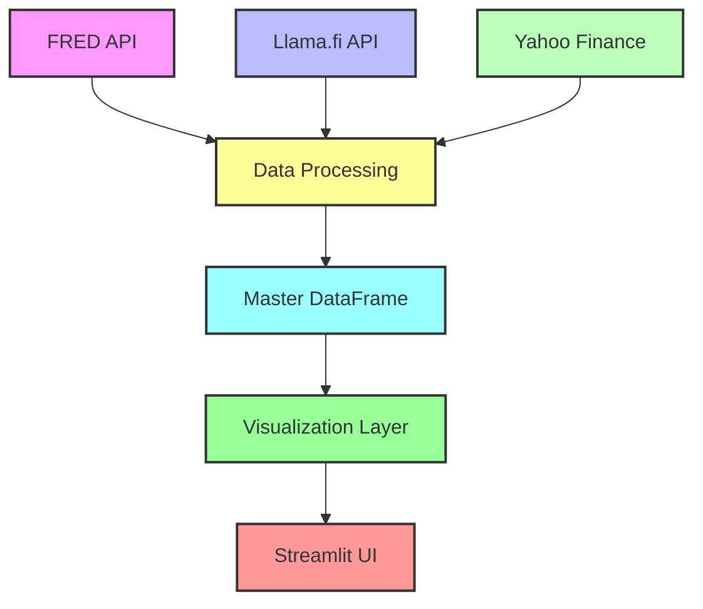

```mermaid
flowchart TD
    A[FRED API] --> D[Data Processing]
    B[Llama.fi API] --> D
    C[Yahoo Finance] --> D
    D[Data Processing] --> E[Master DataFrame]
    E --> F[Visualization Layer]
    F --> G[Streamlit UI]
    style A fill:#f9f,stroke:#333,stroke-width:2px
    style B fill:#bbf,stroke:#333,stroke-width:2px
    style C fill:#bfb,stroke:#333,stroke-width:2px
    style D fill:#ff9,stroke:#333,stroke-width:2px
    style E fill:#9ff,stroke:#333,stroke-width:2px
    style F fill:#9f9,stroke:#333,stroke-width:2px
    style G fill:#f99,stroke:#333,stroke-width:2px
```
